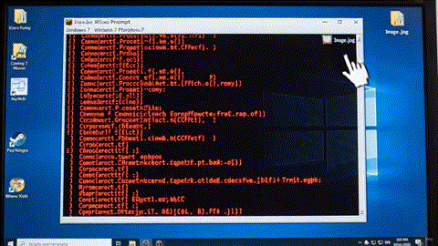

  

> *Writing Python in the Windows 7 terminal is the perfect combination: your code runs as slowly as the waves in the sea, and your system is old enough to justify the fact that you're still stuck on Python 3.8.*

# 💙 I love blue
