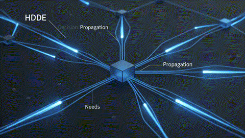

<div align="center">

  

  <br />

  <h1>AMLAACH</h1>
  <h3><code>SYSTEMS ARCHITECT &bull; LOW-LATENCY INFRASTRUCTURE &bull; APPLIED AI</code></h3>

  <p>
    <em>"Architecting deterministic, zero-allocation engines and high-throughput systems."</em>
  </p>

  <p>
    <a href="https://amlaach.github.io/personal-site/">
      
    </a>
    <a href="https://github.com/Amlaach">
      
    </a>
    <a href="https://github.com/Amlaach?tab=repositories">
      
    </a>
  </p>

  <p>
    
    
    
    
    
    
  </p>

</div>

---

### 🏛️ Engineering Philosophy

> **Precision over presumption. Mechanical sympathy over abstraction.**  
> Designing software at the intersection of bare-metal efficiency and scalable distributed intelligence. Focused on cache-friendly data structures, zero-overhead execution paths, and autonomous decision systems.

```ascii
[ Input Stream ] ---> | HDDE Core Decision | ---> [ Dynamic Expert Routing ] ---> [ Sub-ms Execution ]
                             |
                   +---------+---------+
                   | Zero-Alloc Memory |
                   +-------------------+
```

---

### ⚡ Key Architectural Highlights

<table>
  <tr>
    <td width="50%" valign="top">
      <h4>🚀 High-Performance Systems & SIMD</h4>
      <ul>
        <li><strong>Data-Oriented Design (DOD / ECS):</strong> Eliminating pointer chasing, structuring cache-coherent memory layouts.</li>
        <li><strong>Zero-Allocation Architectures:</strong> Predictable frame budgets, arena allocators, low-overhead runtimes.</li>
        <li><strong>Bare-Metal C & Rust:</strong> Direct hardware engagement, SIMD acceleration, and multi-threaded throughput.</li>
      </ul>
    </td>
    <td width="50%" valign="top">
      <h4>🧠 Autonomous Systems & AI Engines</h4>
      <ul>
        <li><strong>Hierarchical Decision Engines (HDDE):</strong> Utility AI, latency-aware propagation across massive agent fleets.</li>
        <li><strong>CPU-Optimized Inference:</strong> Highly specialized quantized matrix operations & compute graph scheduling.</li>
        <li><strong>Vector & Semantic Retrieval:</strong> Millisecond-latency dense indexing, embeddings, and intelligent agents.</li>
      </ul>
    </td>
  </tr>
</table>

---

### 🔬 Flagship Projects

<table align="center" width="100%">
  <tr>
    <td width="50%" valign="top">
      <h3>⚡ <a href="https://github.com/Amlaach/HDDE-A-Zero-Allocation-Hierarchical-Utility-Architecture">HDDE Architecture</a></h3>
      <p><em>Zero-Allocation Hierarchical Decision Engine (Rust)</em></p>
      <p>A high-performance decision engine for games & large simulations. Fuses Utility AI, A-Life, hierarchical command propagation, and data-oriented ECS into a scalable architecture driving thousands of autonomous entities with deterministic behavior.</p>
      <code>Rust</code> &bull; <code>ECS</code> &bull; <code>Utility AI</code> &bull; <code>Zero Allocation</code>
    </td>
    <td width="50%" valign="top">
      <h3>🧠 <a href="https://github.com/Amlaach/project-zero">Project Zero</a></h3>
      <p><em>Bare-Metal CPU-Optimized LLM Inference (C)</em></p>
      <p>Custom-built inference engine designed from first principles in pure C. Optimized for modern CPU architectures with SIMD instructions, minimal footprint, and zero dependency overhead.</p>
      <code>C</code> &bull; <code>SIMD</code> &bull; <code>Deep Learning</code> &bull; <code>Low-Level Compute</code>
    </td>
  </tr>
  <tr>
    <td width="50%" valign="top">
      <h3>🔍 <a href="https://github.com/Amlaach/otzaria-semantic-search">Otzaria Semantic Search</a></h3>
      <p><em>Next-Gen Vector & Semantic Retrieval Engine (Rust)</em></p>
      <p>Advanced vector search backend delivering instant semantic lookup over extensive corpora, combining dense embeddings with high-throughput indexing algorithms.</p>
      <code>Rust</code> &bull; <code>Vector Search</code> &bull; <code>NLP</code> &bull; <code>Embeddings</code>
    </td>
    <td width="50%" valign="top">
      <h3>🤖 <a href="https://github.com/Amlaach/SmartiAI-Agent-for-Windows">SmartiAI Agent</a></h3>
      <p><em>Autonomous Windows Operating Agent (Python)</em></p>
      <p>A lightweight, autonomous agent framework for Windows. Features system orchestration, protocol tooling, Model Context Protocol (MCP), and extensible autonomous execution.</p>
      <code>Python</code> &bull; <code>Autonomous Agents</code> &bull; <code>MCP</code> &bull; <code>System Automation</code>
    </td>
  </tr>
</table>

---

### 🛠️ Core Technology Matrix

```yaml
Core Systems:        [ Rust, C, Modern C++, Data-Oriented ECS, SIMD, Multi-threading ]
Autonomous / AI:     [ Hierarchical Utility AI, LLM Inference Engines, MCP, Multi-Agent Systems ]
Information Engines: [ Vector Search, Dense Embeddings, Information Retrieval, High-Throughput Search ]
Platforms & Tools:   [ Linux / Windows Internals, Git, CMake / Cargo, Asynchronous Pipelines ]
```

---

### 📊 Telemetry & Systems Status

<div align="center">
  
  &nbsp;
  
</div>

<br />

<div align="center">
  <sub>Designed with precision &bull; Driven by algorithms &bull; <b>Code That Works.</b></sub>
</div>
